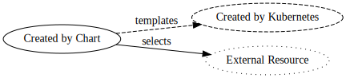

# Generic Service Helm Chart

This Helm chart simplifies deploying a typical "80% case" service on Kubernetes. It takes care of creating common [Resources](#resources) such as `Deployment`, `Service` and `Ingress`. It also provides optional support for:

- [Istio](https://istio.io/) for routing
- [Prometheus Operator](https://github.com/prometheus-operator/prometheus-operator) for monitoring
- [Jaeger](https://www.jaegertracing.io/) for tracing
- [Flagger](https://flagger.app/) for canary deployments

## Getting started

This chart is most commonly used as a dependency instead of installing it directly. You can reference it in your chart by adding this to your `Chart.yaml`:

```yaml
dependencies:
  - name: generic-service
    version: ~1.1.0
    repository: https://helm.nano-byte.net
    alias: app
```

You can then add static configuration to your `values.yaml` like this:

```yaml
app:
  image:
    repository: myservice
    tag: 1.2.3
```

## Values

| Value                                     | Default                    | Description                                                                                              |
| ----------------------------------------- | -------------------------- | -------------------------------------------------------------------------------------------------------- |
| `name`                                    | Release Name               | The name of the service (used for `app.kubernetes.io/name` label)                                        |
| `fullname`                                | Release Name (+ `name`)    | The name of the service instance (used for resource names and `app.kubernetes.io/instance` label)        |
| `image.registry`                          | `docker.io`                | The Registry containing the Docker Image to run (also used as the name of an optional Image Pull Secret) |
| `image.repository`                        | __required__               | The name of the Docker Image image to run (without the Registry)                                         |
| `image.tag`                               | __required__               | The tag of the Docker Image to run (also used for `app.kubernetes.io/version` label)                     |
| `image.pullPolicy`                        | `IfNotPresent`             | Set to `Always` to try to pull new versions of the Docker Image                                          |
| `args`                                    | `[]`                       | The command-line arguments passed to the service                                                         |
| `env`                                     | `{}`                       | The environment variables passed to the service                                                          |
| `config`                                  | `{}`                       | YAML configuration to be mounted as a file in the container at `$CONFIG_FILE`                            |
| `additionalConfigs`                       | `[]`                       | Additional `ConfigMap`s (with key named `data.yaml`) to be mounted and appended to `$CONFIG_FILE`        |
| `livenessProbe`                           |                            | Probe that causes the service to be restarted when failing                                               |
| `readinessProbe`                          |                            | Probe that prevents the service from receiving traffic when failing                                      |
| `labels`                                  | `{}`                       | Additional labels to set on all generated resources                                                      |
| `annotations`                             | `{}`                       | Additional annotations to set on the `Pod`s                                                              |
| `resources.requests`                      | `{memory: 64M}`            | The minimum resources requested/reserved for the service                                                 |
| `resources.limits`                        | `{memory: 128M}`           | The maximum resources the service can use                                                                |
| `replicas`                                | `1`                        | The number of instances of the service to run (set at least `2` for Pod Disruption Budget)               |
| `autoscaling.enabled`                     | `false`                    | Enables automatic starting of additional instances based on CPU load                                     |
| `autoscaling.maxReplicas`                 | `3`                        | The maximum number of instances to run (must be larger than `replicas`)                                  |
| `autoscaling.targetCpu`                   | `50`                       | The desired average CPU load in percent                                                                  |
| `rollingUpdate`                           | `true`                     | Controls whether to wait for new versions to be up and running before shutting down old version          |
| `nodeSelector`                            | `{}`                       | Node labels required for scheduling this service, also used as tolerations                               |
| `persistence.enabled`                     | `false`                    | Enables persistent storage for the service                                                               |
| `persistence.storageClass`                |                            | The type of disk to use for storage instead of the cluster default                                       |
| `persistence.size`                        | `1G`                       | The size of the persistent volume to create for the service                                              |
| `persistence.mountPath`                   | __required if enabled__    | The mount path for the storage inside the container                                                      |
| `secrets[].name`                          | __required if used__       | The name of the Kubernetes `Secret`                                                                      |
| `secrets[].mountPath`                     | __required if used__       | The mount path for the `Secret` inside the container                                                     |
| `secrets[].subPath`                       |                            | The path of a single file in the `Secret` relative to the given `mountPath`                              |
| `secrets[].files`                         |                            | Map of file names to base64-encoded content; leave empty to reference existing `Secret`                  |
| `ingress.enabled`                         | `false`                    | Enables ingress into the service (either cluster-internal or public)                                     |
| `ingress.port`                            | `80`                       | The container port ingress traffic is routed to                                                          |
| `ingress.protocol`                        | `http`                     | The protocol used for ingress (e.g., `http` or `grpc`)                                                   |
| `ingress.domains`                         | `[]`                       | The public domain names under which the service is exposed (leave empty for cluster-internal only)       |
| `ingress.paths`                           | `[]`                       | HTTP path prefixes to accept ingress traffic for (leave empty to accept traffic for any path)            |
| `ingress.class`                           |                            | The ingress controller to use (if `ingress.domains` is set and `ingress.istio.enabled` is `false`)       |
| `ingress.annotations`                     | `{}`                       | Annotations for `Ingress` resource (if `ingress.domains` is set and `ingress.istio.enabled` is `false`)  |
| `ingress.tls`                             | `[]`                       | TLS config for `Ingress` resource (if `ingress.domains` is set and `ingress.istio.enabled` is `false`)   |
| `ingress.istio.enabled`                   | `false`                    | Use Istio `VirtualService` instead of Kubernetes `Ingress` resource                                      |
| `ingress.istio.gateways`                  | `[]`                       | The names of the Istio `Gateway`s to use                                                                 |
| `ingress.istio.httpHeaders`               | `{}`                       | Custom HTTP response headers                                                                             |
| `ingress.istio.corsPolicy`                | `{}`                       | [Istio CORS policy](https://istio.io/docs/reference/config/networking/virtual-service/#CorsPolicy)       |
| `ingress.istio.timeout`                   | `15s`                      | [Istio timeout](https://istio.io/docs/tasks/traffic-management/request-timeouts/)                        |
| `ingress.istio.retries`                   | `{}`                       | [Istio retry policy](https://istio.io/docs/reference/config/networking/virtual-service/#HTTPRetry)       |
| `flagger.enabled`                         | `false`                    | Use Flagger for canary rollouts                                                                          |
| `flagger.canaryAnalysis`                  | success>99%, latency<500ms | Configuration for canary analysis                                                                        |
| `tracing.enabled`                         | `false`                    | Enable tracing with Jaeger agent (injected as sidecar)                                                   |
| `tracing.probability`                     | `1`                        | Probability of any single trace being sampled; can be overridden for incoming requests e.g. via Istio    |
| `monitoring.enabled`                      | `false`                    | Use Prometheus for monitoring / metrics scraping                                                         |
| `monitoring.port`                         | `9100`                     | The port to be scraped for monitoring data                                                               |
| `monitoring.path`                         | `/metrics`                 | The path to be scraped for monitoring data                                                               |
| `monitoring.interval`                     | `1m`                       | The interval at which monitoring data is scraped                                                         |
| `alerting.enabled`                        | `true`                     | Applies default alert rules like unavailable pods or RAM usage (if `monitoring.enabled` is `true`)       |
| `alerting.labels`                         | `{}`                       | Labels to apply to generic alert rules in addition to `component` and `severity`                         |
| `alerting.memoryUsage.thresholdFactor`    | `0.9`                      | The maximum factor (between `0` and `1`) of memory usage allowed before alerting                         |
| `alerting.http4xxRatio.sampleInterval`    | `5m`                       | The time interval in which to measure ratio of HTTP 4xx responses for the current state                  |
| `alerting.http4xxRatio.referenceInterval` | `1d`                       | The time interval in which to measure ratio of HTTP 4xx responses as a reference for the normal state    |
| `alerting.http4xxRatio.thresholdFactor`   | `1.5`                      | The maximum factor between the current state and the normal state of HTTP 4xx response ratio allowed     |
| `alerting.responseTime.sampleInterval`    | `1h`                       | The time interval in which to measure average HTTP response times for the current state                  |
| `alerting.responseTime.referenceInterval` | `1d`                       | The time interval in which to measure average HTTP response times for the normal state                   |
| `alerting.responseTime.thresholdFactor`   | `1.5`                      | The maximum factor between the current state and the normal state of HTTP response times allowed         |
| `sidecars`                                | `[]`                       | Additional sidecar containers to be added to the `Pod`                                                   |
| `rbac.roles`                              | `[]`                       | Namespace-specific Kubernetes RBAC Roles to assign to the service                                        |
| `rbac.clusterRoles`                       | `[]`                       | Cluster-wide Kubernetes RBAC Roles to assign to the service                                              |

## Environment variables

In addition to the environment variables specified via the `env` value, the following dynamic environment variables are automatically set:

| Value           | Description                                               |
| --------------- | --------------------------------------------------------- |
| `POD_NAME`      | The name of the Kubernetes pod                            |
| `POD_NAMESPACE` | The namespace of the Kubernetes pod                       |
| `POD_IP`        | The cluster-internal IP of the Kubernetes pod             |
| `NODE_NAME`     | The name of the Kubernetes node the pod is running on     |
| `CONFIG_FILE`   | `:`-separated list of paths of mounted YAML config files  |
| `PORT`          | The `ingress.port` (if `ingress.enabled` is `true`)       |
| `METRICS_PORT`  | The `monitoring.port` (if `monitoring.enabled` is `true`) |

## Resources

This Helm chart generates a number of Resources based on the specified [Values](#values). These resources reference each other:


Legend:  


**Deployment**  
Instructs Kubernetes to create a certain number of `Pod`s (`replicas`) running a specific `image`.

**Service**  
Created if `ingress.enabled` or `monitoring.enabled` is `true`.

**Ingress**  
Created if `ingress.enabled` is `true`, `ingress.domains` is not empty and `ingress.istio.enabled` is `false`.

**VirtualService**  
Created if `ingress.enabled` and `ingress.istio.enabled` are both `true`.

**ServiceMonitor**  
Created if `monitoring.enabled` is `true`.

**PrometheusRule**  
Created if `alerting.enabled` is `true`.

**ConfigMap**
Created if `config` is not empty.

**PersistentVolumeClaim**  
Created if `persistence.enabled` is `true`.

**ServiceAccount**  
Created if `rbac.roles` and/or `rbac.clusterRoles` is not empty.

**RoleBinding**  
Created once for every entry in `rbac.roles`.

**ClusterRoleBinding**  
Created once for every entry in `rbac.clusterRoles`.

**PodDisruptionBudget**  
Created if `replicas` is greater than `1`.

**HorizontalPodAutoscaler**  
Created if `autoscaling.enabled` is `true`.
